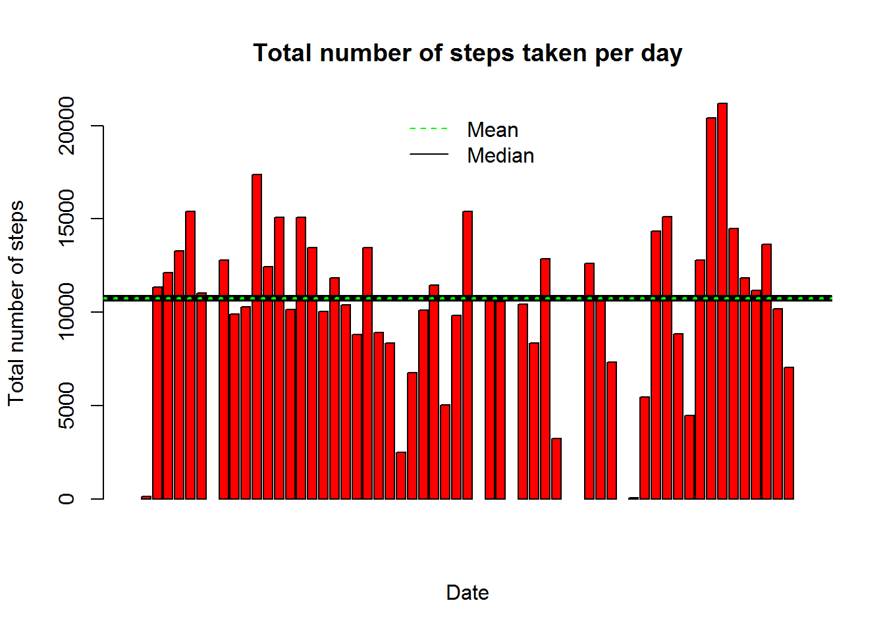
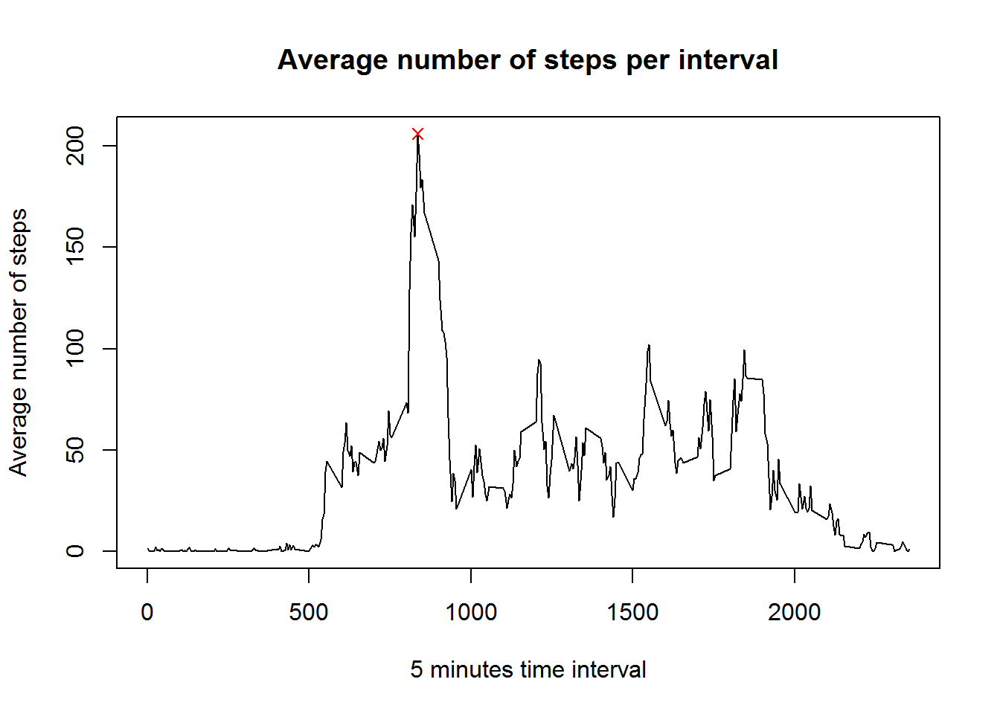
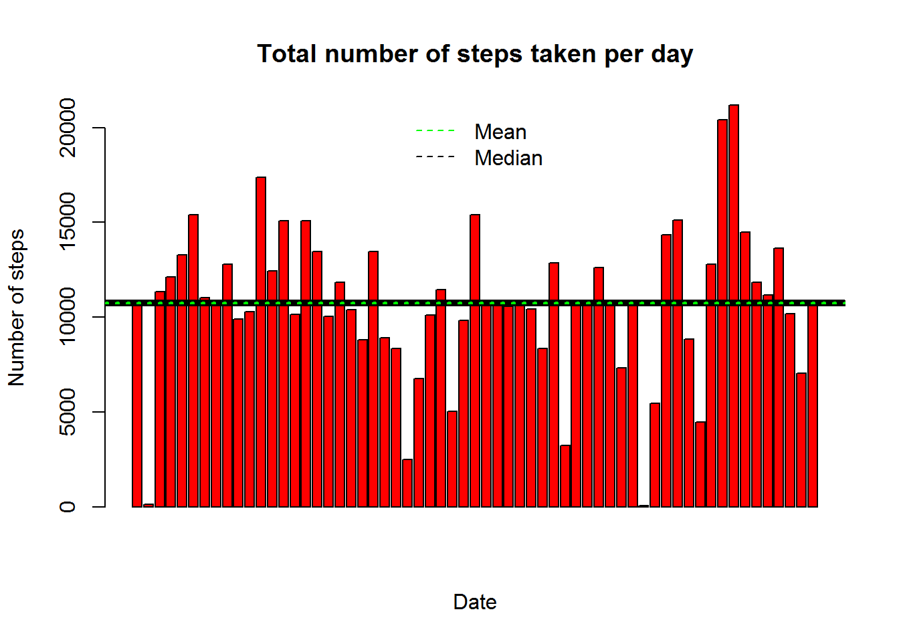
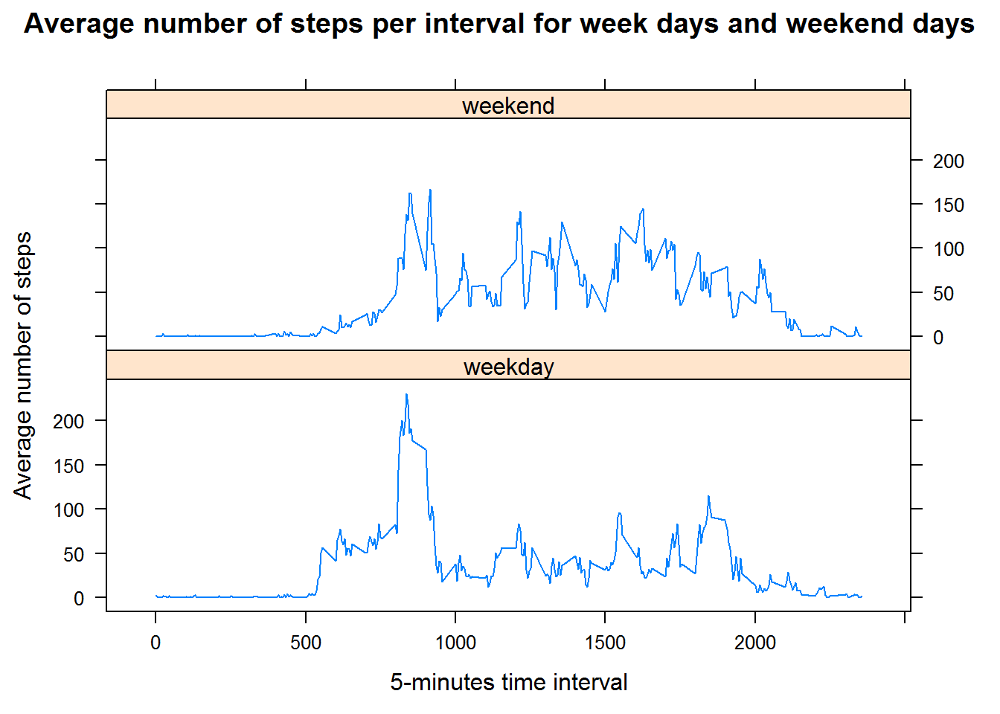

Introduction
============

This paper contains the work I did to pass the week 2 of "Reproducible
Research" lecture from Coursera.

The aim here is to study a set of data containing the number of steps
somebody did by intervals of 5 minutes time between the 1st of October
and the 30th of november 2012 and to report this study into a R Markdown
file.

Getting the data
================

The data are available here
<https://d396qusza40orc.cloudfront.net/repdata%2Fdata%2Factivity.zip>. I
downloaded it in my working directory and called it **data** :

      if (!file.exists("activity.csv")) { 
        unzip("./activity.zip")
      }
      
      data <- read.csv("activity.csv")

Let's have an idea of what the data look like :

    str(data)

    ## 'data.frame':    17568 obs. of  3 variables:
    ##  $ steps   : int  NA NA NA NA NA NA NA NA NA NA ...
    ##  $ date    : Factor w/ 61 levels "2012-10-01","2012-10-02",..: 1 1 1 1 1 1 1 1 1 1 ...
    ##  $ interval: int  0 5 10 15 20 25 30 35 40 45 ...

So the data.frame data contains 17568 observations and 3 variables :
steps, date and interval.

Question 1 : What is mean total number of steps taken per day?
==============================================================

Here is the assignment :

1.  Make a histogram of the total number of steps taken each day.

2.  Calculate and report the mean and median total number of steps taken
    per day.

First of all, I aggregated the number of steps counted for each date of
the period of study, and I put it in a data.frame named
**totalNumberOfStepsPerDay**. I also named its columns "Date" and
"Total.Number.Of.Steps" :

    totalNumberOfStepsPerDay <- with(data, aggregate(steps, by = list(date), sum)) 
    names(totalNumberOfStepsPerDay)[1] <- "Date" 
    names(totalNumberOfStepsPerDay)[2] <- "Total.Number.Of.Steps" 

I presented the total number of steps vs date, into a barplot. I added
the mean and the median (black and green lines) to the plot too :

    barplot(totalNumberOfStepsPerDay$Total.Number.Of.Steps, 
              col="red", 
              main = "Total number of steps taken per day" , 
              xlab ="Date" , 
              ylab = "Total number of steps")
      abline(h=median(totalNumberOfStepsPerDay$Total.Number.Of.Steps, na.rm = TRUE), 
             col="black", 
             lwd = 5)
      abline(h=mean(totalNumberOfStepsPerDay$Total.Number.Of.Steps, na.rm = TRUE), 
             col="green", 
             lty=3,
             lwd=2)
      legend("top", 
             c("Mean","Median"),
             lty = c(mean(totalNumberOfStepsPerDay$Total.Number.Of.Steps, na.rm = TRUE),
             median(totalNumberOfStepsPerDay$Total.Number.Of.Steps, na.rm = TRUE)), 
             col = c("green", "black"), 
             bty = "n",
             border = TRUE)

Looking at the plot, it seems the mean and the median of steps taken per
day are very close. Which is true :

    mean_steps <- mean(totalNumberOfStepsPerDay$Total.Number.Of.Steps, na.rm = TRUE)
    mean_steps

    ## [1] 10766.19

    median_steps <- median(totalNumberOfStepsPerDay$Total.Number.Of.Steps, na.rm = TRUE)
    median_steps

    ## [1] 10765

The mean equals 1.076618910^{4} and the median equals 10765.

Question 2 : What is the average daily activity pattern?
========================================================

Here is the assignment :

1.  Make a time series plot (i.e. type = "l") of the 5-minute
    interval (x-axis) and the average number of steps taken, averaged
    across all days (y-axis)

2.  Which 5-minute interval, on average across all the days in the
    dataset, contains the maximum number of steps?

To obtain the asked plot, I grouped the data from **data** by interval
and I calculated the mean for each interval. I called the data set
**averageNumberOfStepsPerInterval** :

    averageNumberOfStepsPerInterval <- aggregate(steps~interval, data=data, mean)

To know which 5-minute interval contains the maximum of steps, I looked
for the index of the maximum number of steps into the
**averageNumberOfStepsPerInterval** :

    indexMax <- which.max(averageNumberOfStepsPerInterval$steps)

This gave me the coordinates of the maximum point :

    averageNumberOfStepsPerInterval$interval[indexMax]

    ## [1] 835

    averageNumberOfStepsPerInterval$steps[indexMax]

    ## [1] 206.1698

Then, I plotted the average number of steps per interval and I also
added the maximum point in red :

    plot(averageNumberOfStepsPerInterval$interval, 
         averageNumberOfStepsPerInterval$steps, 
         type = "l", 
         main = "Average number of steps per interval", 
         xlab = "5 minutes time interval", 
         ylab = "Average number of steps")
    points(averageNumberOfStepsPerInterval$interval[indexMax], 
           averageNumberOfStepsPerInterval$steps[indexMax], 
           pch = 4,
           col = "red")

Conclusion : it's during the interval 835 that on average we have the
maximum number of steps.

Question 3 : Imputing missing values
====================================

Here is the assignment :

1.  Calculate and report the total number of missing values in the
    dataset (i.e. the total number of rows with NAs)

2.  Devise a strategy for filling in all of the missing values in
    the dataset. The strategy does not need to be sophisticated. For
    example, you could use the mean/median for that day, or the mean for
    that 5-minute interval, etc.

3.  Create a new dataset that is equal to the original dataset but with
    the missing data filled in.

4.  Make a histogram of the total number of steps taken each day and
    Calculate and report the mean and median total number of steps taken
    per day. Do these values differ from the estimates from the first
    part of the assignment? What is the impact of imputing missing data
    on the estimates of the total daily number of steps?

Theres is 2304 NA values in **data** :

    sum(is.na(data$steps))

    ## [1] 2304

To fill all the missing values in the data set, I decided to replace NA
values by the mean for the corresponding 5-minutes interval found into
the **averageNumberOfStepsPerInterval** data set. The new data set,
equal to the original one but without the NA values, is called
**dataWithoutNA** :

    dataWithoutNA <- data
    for (i in 1:dim(dataWithoutNA)[1])
    {
      if (is.na(dataWithoutNA$steps[i]))
      {
      dataWithoutNA$steps[i] = averageNumberOfStepsPerInterval$steps[averageNumberOfStepsPerInterval$interval == dataWithoutNA$interval[i]]
      }
    }

Then, as before, I grouped the steps by date and summed it for each
date. I put it in a data.frame named **totalNumberOfStepsPerDay2** :

    totalNumberOfStepsPerDay2 <- with(dataWithoutNA, aggregate(steps, by = list(date), sum)) 
    names(totalNumberOfStepsPerDay2)[1] <- "Date" 
    names(totalNumberOfStepsPerDay2)[2] <- "Total.Number.Of.Steps" 

This time, mean and median are equal :

    mean_steps2 <- mean(totalNumberOfStepsPerDay2$Total.Number.Of.Steps, na.rm = TRUE)
    mean_steps2

    ## [1] 10766.19

    median_steps2 <- median(totalNumberOfStepsPerDay2$Total.Number.Of.Steps, na.rm = TRUE)
    median_steps2

    ## [1] 10766.19

Here is the plot exhibiting total number of steps vs date with NA values
filled :

    barplot(totalNumberOfStepsPerDay2$Total.Number.Of.Steps, 
            col="red", 
            main = "Total number of steps taken per day" , 
            xlab ="Date" , 
            ylab = "Number of steps")
    abline(h=median(totalNumberOfStepsPerDay2$Total.Number.Of.Steps, na.rm = TRUE), 
           col="black", 
           lwd = 5)
    abline(h=mean(totalNumberOfStepsPerDay2$Total.Number.Of.Steps, na.rm = TRUE), 
           col="green", 
           lty=3,
           lwd=2)
    legend("top", 
           c("Mean","Median"),
           lty = c(mean(totalNumberOfStepsPerDay2$Total.Number.Of.Steps, na.rm = TRUE),   
           median(totalNumberOfStepsPerDay2$Total.Number.Of.Steps, na.rm = TRUE)), 
           col = c("green", "black"), 
           bty = "n",
           border = TRUE)

Now that we got rid of NA values, the mean keeps its same value whereas
the median is a little higher and equals the mean now.

Question 4 : Are there differences in activity patterns between weekdays and weekends?
======================================================================================

Here is the assignment :

1.  Create a new factor variable in the dataset with two levels -
    "weekday" and "weekend" indicating whether a given date is a weekday
    or weekend day.

2.  Make a panel plot containing a time series plot (i.e. type = "l") of
    the 5-minute interval (x-axis) and the average number of steps
    taken, averaged across all weekday days or weekend days (y-axis).

For the moment, the dates into date column are "facors" :

    class(dataWithoutNA$date)

    ## [1] "factor"

To be able to use the "ymd" function and know which days are week days
and which days are weekend days, I changed the format of date columns in
my **dataWithoutNA** data set :

    library(lubridate)

    ## 
    ## Attaching package: 'lubridate'

    ## The following object is masked from 'package:base':
    ## 
    ##     date

    dataWithoutNA <- mutate(dataWithoutNA, date = ymd(dataWithoutNA$date))

Then, I added a **Day.Type** variable to my data set, saying if the date
is a week day or a weekend day :

    dataWithoutNA$Day.Type = case_when(weekdays(dataWithoutNA$date)=="dimanche" | weekdays(dataWithoutNA$date)=="samedi" ~ "weekend", TRUE ~ "weekday")

This gave me the following result :

    str(dataWithoutNA)

    ## 'data.frame':    17568 obs. of  4 variables:
    ##  $ steps   : num  1.717 0.3396 0.1321 0.1509 0.0755 ...
    ##  $ date    : Date, format: "2012-10-01" "2012-10-01" ...
    ##  $ interval: int  0 5 10 15 20 25 30 35 40 45 ...
    ##  $ Day.Type: chr  "weekday" "weekday" "weekday" "weekday" ...

Finally, I built a data set, **finalData**, with the average number of
steps by interval in each case : week days and weekends.

    finalData <- aggregate(steps~interval+Day.Type, data=dataWithoutNA, mean)

Here is a plot presenting the average number of steps per interval for
week days and weekend days :

    xyplot(steps~interval|Day.Type, 
           data = finalData, 
           layout=c(1,2), 
           type="l",
           main="Average number of steps per interval for week days and weekend days",
           xlab="5-minutes time interval", 
           ylab="Average number of steps")

I distinguish 2 main periods :

-   **period 1** : after 2000 and from 0 to 500 intervals

-   **period 2** : from 500 to 1000 intervals

-   **period 3** : from 1000 to 2000 intervals

I suppose period 1 corresponds to night. We have not much activity
during these intervals, except at the beginning of the period during
weekends, as people go to bed later.

Week days and weekend days both have a pic of activity during the period
2. But it is more important and begins a little bit earlier during week
days as it should correspond to work days hours.

On the other hand, during period 3, there is less activity. But it's
more important for week days than for weekend days.
